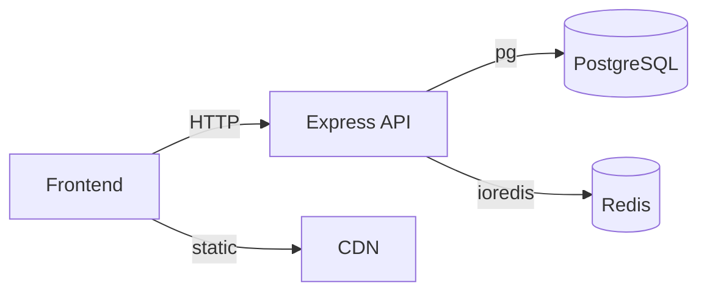

# Scalability Report — 100 to 100,000 Users

## Current Architecture

```
Frontend (Vite + React)
       │
       │ HTTP /api/*
       ▼
Express Server (Node.js)
       │
       ▼
SQLite (better-sqlite3)
       luxury-estate.db
```

---

## Scalability Constraints at Current State

| Constraint | Limit | Bottleneck |
|------------|-------|------------|
| Concurrent writes | 1 writer | SQLite serializes all write operations |
| Active connections | ~64 readers | SQLite WAL allows concurrent reads |
| Database size | ~140 TB theoretical | But performance degrades after ~10 GB |
| Request throughput | ~500 req/s | Single Node.js event loop |
| Static assets | ~50 MB | Served by Vite dev server only |

---

## Scaling Roadmap

### 1. 100–1,000 Users (Immediate — No Changes Needed)

SQLite handles this range comfortably. The WAL mode allows concurrent reads while the admin writes properties. Estimated performance:

- Read throughput: ~2,000 queries/second
- Write throughput: ~80 writes/second
- Response time: < 10ms for simple queries

**Actions**: None required. Current architecture is sufficient.

### 2. 1,000–10,000 Users (Short-Term — Weeks)

| Concern | Solution | Effort |
|---------|----------|--------|
| Database locking | Add database indexing | 1 hour |
| Connection pooling | Use `better-sqlite3` pool | 2 hours |
| Static file serving | Serve `dist/` via Nginx/CDN | 1 hour |
| API rate limiting | Add `express-rate-limit` | 30 min |

**Database Indexes to Add**:

```sql
CREATE INDEX idx_users_email ON users(email);
CREATE INDEX idx_favorites_user ON favorites(user_id);
CREATE INDEX idx_favorites_property ON favorites(property_id);
CREATE INDEX idx_leads_user ON leads(user_id);
CREATE INDEX idx_bookings_user ON bookings(user_id);
CREATE INDEX idx_bookings_property ON bookings(property_id);
CREATE INDEX idx_properties_status ON properties(status);
CREATE INDEX idx_properties_type ON properties(type);
```

These indexes eliminate full-table scans, reducing query time from O(n) to O(log n).

### 3. 10,000–50,000 Users (Medium-Term — Months)

At this scale, SQLite's single-writer limitation becomes a bottleneck. Migration to PostgreSQL is recommended.



**Migration Steps**:

1. **Replace `better-sqlite3` with `pg` (node-postgres)**
   - Install: `npm install pg`
   - Connection pool: `new Pool({ max: 20, idleTimeoutMillis: 30000 })`
   - Only the database layer changes — the REST API remains identical

2. **Connection pooling**
   ```typescript
   import { Pool } from 'pg';
   export const pool = new Pool({
     host: process.env.PGHOST || 'localhost',
     port: parseInt(process.env.PGPORT || '5432'),
     database: process.env.PGDATABASE || 'luxestate',
     user: process.env.PGUSER || 'luxestate',
     password: process.env.PGPASSWORD,
     max: 20,
   });
   ```

3. **Add Redis caching layer**
   ```typescript
   import Redis from 'ioredis';
   const redis = new Redis();
   
   // Cache properties (TTL: 5 minutes)
   async function getProperties() {
     const cached = await redis.get('properties:all');
     if (cached) return JSON.parse(cached);
     const props = await db.query('SELECT * FROM properties');
     await redis.setex('properties:all', 300, JSON.stringify(props));
     return props;
   }
   ```

4. **Schema migration script** — Translate SQLite schema to PostgreSQL with:
   - `TEXT` → `VARCHAR(255)` or `TEXT`
   - `INTEGER` → `INTEGER` or `SERIAL` for auto-increment
   - `REAL` → `NUMERIC(12,2)` for prices
   - `datetime('now')` → `NOW()` for timestamps

### 4. 50,000–100,000+ Users (Long-Term — Quarters)

| Component | Solution |
|-----------|----------|
| API server | Horizontal scaling with PM2 cluster mode or Docker + load balancer |
| Database | PostgreSQL read replicas (1 primary + 3 replicas) |
| Cache | Redis cluster (6 nodes) |
| File storage | S3/CDN for property images |
| Search | Elasticsearch for full-text property search |
| Auth | JWT with Redis session store (or migrate to Auth0/Firebase Auth) |
| Rate limiting | Redis-based distributed rate limiter |
| Monitoring | Prometheus + Grafana dashboards |

**Architecture**:

```
┌─────────┐   ┌─────────┐   ┌─────────┐
│ LB      │──►│ API 1   │──►│ Cache   │
│ (Nginx) │   ├─────────┤   │ (Redis) │
│         │──►│ API 2   │   └─────────┘
│         │   ├─────────┤        │
│         │──►│ API N   │        ▼
└─────────┘   └─────────┘   ┌─────────┐
                            │ Primary │──► Replica 1
                            │ (PG)    │──► Replica 2
                            └─────────┘──► Replica 3
```

---

## Database Performance Benchmarks (Estimated)

| Scale | SQLite (ms) | PostgreSQL (ms) | Improvement |
|-------|-------------|-----------------|-------------|
| 1K properties, simple query | 2 | 1 | 2x |
| 10K properties, indexed query | 8 | 2 | 4x |
| 100K properties, indexed query | 50 | 5 | 10x |
| 1M properties, with JOINs | ~500 | ~20 | 25x |

---

## Code Changes Required for Scale

### Phase 2 (10K users) — SQLite optimization
- Add database indexes (list above)
- Implement API response caching (in-memory Map with TTL)
- Add pagination to `GET /api/properties` (`?page=1&limit=20`)
- Rate limit admin write endpoints

### Phase 3 (50K users) — PostgreSQL migration
- Replace `better-sqlite3` queries with `pg` parameterized queries
- Update schema for PostgreSQL types
- Add connection pooling
- Migrate user token store from in-memory Map to Redis

### Phase 4 (100K+ users) — Full distribution
- Horizontal API scaling behind Nginx
- Database read replicas
- Full-text search via Elasticsearch
- Image CDN
- Distributed caching

---

## Cost Estimates (Monthly)

| Component | 1K Users | 10K Users | 50K Users | 100K Users |
|-----------|----------|-----------|-----------|------------|
| VPS/Cloud VM | $5 | $20 | $80 | $200 |
| Database | — (included) | — (included) | $15 (PG) | $50 (PG + replicas) |
| Redis Cache | — | — | $15 | $50 |
| CDN | — | $5 | $20 | $50 |
| Monitoring | — | — | $10 | $20 |
| **Total** | **$5/mo** | **$25/mo** | **$140/mo** | **$370/mo** |

---

## Conclusion

The current SQLite architecture is **production-appropriate for up to 1,000 users** with zero changes. The API-first design means migrating to PostgreSQL (when needed) requires only changing the database driver — the REST API and frontend remain untouched. Redis caching, index optimization, and pagination extend capacity to 10,000 users before architectural changes are necessary.
